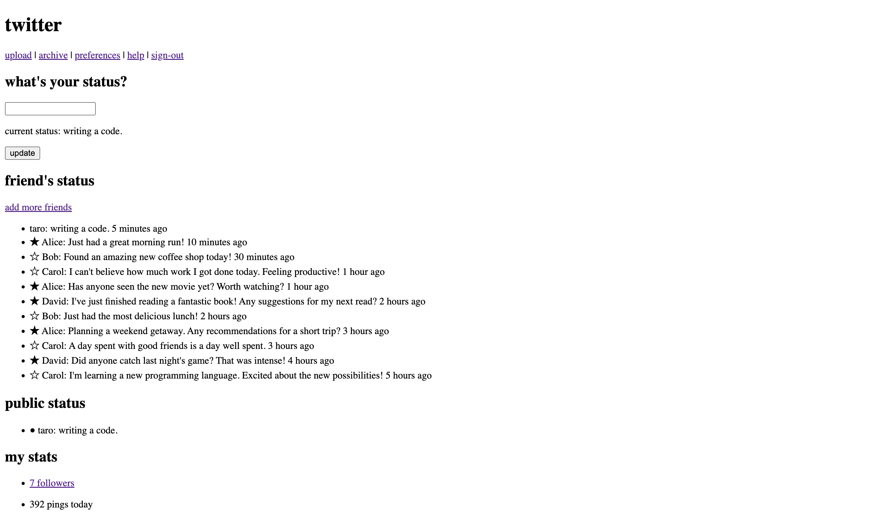
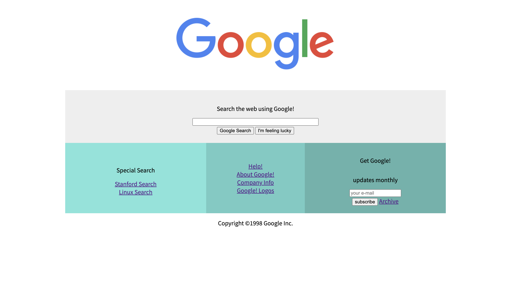

<!--
theme: gaia
class:
 - invert
headingDivider: 2
paginate: true
-->

<!--
_class:
 - lead
 - invert
-->

# アルゴリズム基礎論

## アルゴリズム基礎論 第 2 回

- コードを書くための準備（ブラウザ・エディタ）は OK？？
- zoom に入って名前を「学籍番号\_氏名」に変更！

## このフェイズの目標

Web アプリケーションの表現方法を知る．

- ~~2023/04/05：オリエンテーション~~
- `2023/04/12：HTML`
- 2023/04/19：CSS
- 2023/04/26：JavaScript01

## 本日やること

HTML で自分の書いたコードをブラウザ画面で見えるようにする．

**2006 年の Twitter 画面を実装しよう！！**



## 本日の流れ

- 1315：スタート
- 1325：HTML の位置づけと概要説明
- 1330：開発の流れの解説，HTML を書いて動かしてみよう
- 1400：HTML を書くときの考え方，よく使うタグの解説
- 1420：Twitter 画面を作ってみよう
- 1445：休憩
- 1500：演習スタート
- 1610：課題の提出案内
- 1625：次回の案内 → 終了

## それではスタート！！

## おつかれさまでした！

- HTML は動きましたか？？
- HTML を使うと，自分の書いたことをブラウザ画面に表示できる！

**課題の提出も忘れずに！4/17 の 23:59 まで**

特に前半は可能な限り応用課題にチャレンジしましょう！

講義では毎回新しい内容が出てきます．前回までの内容に慣れていると楽に進めるので，応用課題にチャレンジしましょう！

## 次回

**次回はオンライン講義です．** 受講場所は同じですが，講師はオンラインです．

HTML に続き，CSS を書いてみましょう！
HTML と CSS を扱えれば web サイトは作れます！

- HTML は「何を」表示するか．
- CSS は「どのように」表示するか．

## アルゴリズム基礎論 第 3 回

- 前回と同様のグループで着席！
- オンライン回は特に助け合いが重要！！
- zoom に入って名前を「学籍番号\_氏名」に変更！

## このフェイズの目標

Web アプリケーションの表現方法を知る．

- ~~2023/04/05：オリエンテーション~~
- ~~2023/04/12：HTML~~
- `2023/04/19：CSS`
- 2023/04/26：JavaScript01

## 本日やること

HTML と CSS で Web サイトをつくる！

**1998 年の Google 画面を実装しよう！！**



## 本日の流れ

- 1315：スタート
- 1325：CSS の書き方，動作確認
- 1340：見た目を変えるときの考え方
- 1400：文字色と背景の設定
- 1420：幅と高さの設定
- 1445：休憩
- 1500：レイアウトの設定 → 演習スタート
- 1625：次回の案内 → 終了

## それではスタート！！

## おつかれさまでした！

- 「見た目」 は変わりましたか？？
- HTML と CSS ができれば Web サイトを作れる（= 仕事できる）！

**課題の提出も忘れずに！4/24 の 23:59 まで**

今回も可能な限り応用課題にチャレンジしましょう！

講義では毎回新しい内容が出てきます．前回までの内容に慣れていると楽に進めるので，応用課題にチャレンジしましょう！

## 次回

**次回は現地で講義です．**

画面を作れるようになったので，いよいよ JavaScript にチャレンジ！

- HTML は「何を」表示するか．
- CSS は「どのように」表示するか．
- JavaScript は「どんな処理をするか」．

## アルゴリズム基礎論 第 4 回

- 前回と同様のグループで着席！
- zoom に入って名前を「学籍番号\_氏名」に変更！

## このフェイズの目標

Web アプリケーションの表現方法を知る．

- ~~2023/04/05：オリエンテーション~~
- ~~2023/04/12：HTML~~
- ~~2023/04/19：CSS~~
- `2023/04/26：JavaScript01`

## 本日やること

JavaScript でおみくじゲームをつくる！

画面上の「おみくじを引く」ボタンをクリックするとランダムな結果が表示される．

JavaScript で処理をつくり，結果を画面に反映させる．

## 本日の流れ

- 1315：スタート・ウォーミングアップ
- 1325：JavaScript の開発手順，変数，数値，文字列
- 1400：ランダムな数をつくる
- 1420：条件分岐
- 1445：休憩
- 1500：クリック時の動作と結果表示
- 1520：演習スタート
- 1625：次回の案内 → 終了

## ウォーミングアップ

質問力を高めよう！！

## 大前提

- 質問するやつは偉い．問題を解決しようとしている．
- 質問するやつは偉い．質問をすることで他の人のヒントになる．
- 質問するやつは偉い．後で同じことで困ったときに解決できる．

ただし，質問のしかたにはコツがあります！

## 質問のコツ

下記 3 点を意識しましょう！

- やりたいことは何か．
- 自分は何をしたか．
- 現状どのような状態か．

## 例（前回の CSS の演習）

- やりたいこと：画像の幅を 450px にしたい．

- 何をしたか：下記のコードを書いた

  ```css
  div {
    width: 450px;
  }
  ```

- どのような状態か：画像の幅が変わらない

## 掲示板を活用しましょう

- 質問は「テキストで」しないとうまくならない．

- 演習中・講義中に掲示板に書き込む！

- 講義中は掲示板を開いておき，すぐ書けるようにしておくこと！

## 掲示板に書き込む練習

下記の準備ができたら掲示板の投稿「できた！」とコメントしてみよう！

- サンプルフォルダのダウンロード → 展開
- エディタでサンプルフォルダを開く（前回までと同様の手順）

## それではスタート！！

## おつかれさまでした！

- 「じゃんけん」 はできましたか？？
- 変数と条件分岐があれば相当のことができる！

**課題の提出も忘れずに！5/8 の 23:59 まで**

今回も可能な限り応用課題にチャレンジしましょう！特に大事！！

「JavaScript の開発に慣れる」「調べながら試行錯誤する」を課題でマスター！

## 次回

**次回はオンラインで講義です．**

JavaScript で作れるようになったので，より複雑な処理にチャレンジ！

より複雑な処理を実現するため「データの形式」を知ろう！

**欠席や遅刻の場合は私にメールください！**

## アルゴリズム基礎論 第 5 回

- 前回と同様のグループで着席！
- zoom に入って名前を「学籍番号\_氏名」に変更！
- 掲示板を開いておく！

## このフェイズの目標

アプリケーションで扱う「データ」を知る．

- `2023/05/10：JavaScript02`

- 2023/05/17：JavaScript03

- 2023/05/24：JavaScript04

- 2023/05/31：JavaScript05

## 本日やること

おみくじゲームの結果を記録しよう！

おみくじを引くと，引いた結果を画面に表示できるようにする．

保存するためのデータ形式をマスターしよう！

## 本日の流れ

- 1315：スタート・ウォーミングアップ

- 1325：「配列」を使って結果を記録する

- 1400：記録した結果を画面に表示しよう

- 1445：休憩

- 1500：演習スタート

- 1625：次回の案内 → 終了

## ウォーミングアップ

続・質問力を高めよう！！

## 質問のコツ

下記 3 点を意識しましょう！

- やりたいことは何か．

- 自分は何をしたか．

- 現状どのような状態か．

## 掲示板を活用しましょう

- 質問は「テキストで」しないとうまくならない．

- 演習中・講義中に掲示板に書き込む！

- 講義中は掲示板を開いておき，すぐ書けるようにしておくこと！

本日の目標：**まずは「できた・できてない」の意思表示をしよう！**

## 掲示板に書き込む練習

下記の準備ができたら掲示板の投稿「できた！」とコメントしてみよう！

- サンプルフォルダのダウンロード → 展開

- エディタでサンプルフォルダを開く（前回までと同様の手順）

## それではスタート！！

## おつかれさまでした！

- 配列は非常に強力です．
- できることがとても多いですが，まずは「配列に慣れる」が大事！

**課題の提出も忘れずに！5/15 の 23:59 まで**

今回も可能な限り応用課題にチャレンジしましょう！演習課題にプラスすることが大事！

「どこまでできていてどこからできていないかを把握」「調べながら試行錯誤する」を課題でマスター！

## 次回

**次回は現地で講義です．**

画面操作を JavaScript と連携させ，よりインタラクティブな処理にチャレンジします！

**欠席や遅刻の場合は私にメールください！**

## アルゴリズム基礎論 第 6 回

- 前回と同様のグループで着席！
- zoom に入って名前を「学籍番号\_氏名」に変更！
- 掲示板を開いておく！

## このフェイズの目標

アプリケーションで扱う「データ」を知る．

- ~~2023/05/10：JavaScript02~~

- `2023/05/17：JavaScript03`

- 2023/05/24：JavaScript04

- 2023/05/31：JavaScript05

## 本日やること

タイピングゲームをつくります！

- 実はほとんど前回と同じ流れで作れます．

- これまでに扱った「条件分岐」「繰り返し」を組み合わせましょう！

## 本日の流れ

- 1315：スタート・ウォーミングアップ

- 1325：【復習】「配列」「乱数」を使用して問題を表示する

- 1400：結果を画面に表示する

- 1445：休憩

- 1500：演習スタート

- 1625：次回の案内 → 終了

## ウォーミングアップ

続続・質問力を高めよう！！

## 質問のコツ

下記 3 点を意識しましょう！

- やりたいことは何か．

- `自分は何をしたか．`

- 現状どのような状態か．

## 自分のやったことを伝える

【大前提】うまくいかないことは悪いことではない！

- 書いたコード

- 動かした結果（エラーメッセージ・画面の様子）

- 講義中は掲示板を開いておき，すぐ書けるようにしておくこと！

本日の目標：**うまくいかないときにはコードをはろう**

## 掲示板に書き込む練習

下記の準備ができたら掲示板の投稿「できた！」とコメントしてみよう！

- サンプルフォルダのダウンロード → 展開

- エディタでサンプルフォルダを開く（前回までと同様の手順）

## それではスタート！！

## おつかれさまでした！

- 「条件分岐」「繰り返し」「配列」を扱えれば大体の処理はできる！

- **課題の提出も忘れずに！5/22 の 23:59 まで**

- 今回も可能な限り応用課題にチャレンジしましょう！演習課題にプラスすることが大事！

「どこまでできていてどこからできていないかを把握」「調べながら試行錯誤する」を課題でマスター！

## 次回

**次回（とその次も）はオンラインで講義です．**

データの形が複雑になってきます！データの作り方，保存のしかたを学びます！

**欠席や遅刻の場合は私にメールください！**

## アルゴリズム基礎論 第 7 回

- 前回と同様のグループで着席！
- zoom に入って名前を「学籍番号\_氏名」に変更！
- 掲示板を開いておく！

## このフェイズの目標

アプリケーションで扱う「データ」を知る．

- ~~2023/05/10：JavaScript02~~

- ~~2023/05/17：JavaScript03~~

- `2023/05/24：JavaScript04`

- 2023/05/31：JavaScript05

## 本日やること

メモ帳をつくります！

- データを「保存」します！

- データの形式は「オブジェクト」をつかいます！

## 本日の流れ

- 1315：スタート・ウォーミングアップ

- 1325：オブジェクトの形式を知る．

- 1335：データを保存してみよう．

- 1405：データをまとめて保存してみよう．

- 1445：休憩

- 1500：演習スタート

- 1625：次回の案内 → 終了

## ウォーミングアップ

うまくいかないときの対処

## うまくいかない場所を特定せよ！

下記 3 点を意識しましょう！

- エラーを読む．

- どこまでできていてどこでうまくいっていないか．

- ↑ の確認に `console.log()` を使用する．

## 細かく検証する

困ったら `console.log()` しよう！

- ボタンが反応しているかどうか．

- 入力した値を取得できているかどうか．

- 処理した結果が意図した通りの値になっているかどうか．

## 準備

下記の準備ができたら掲示板の投稿「できた！」とコメントしてみよう！

- サンプルフォルダのダウンロード → 展開

- エディタでサンプルフォルダを開く（前回までと同様の手順）

## それではスタート！！

## おつかれさまでした！

- データを保存できるようになりました！

- **課題の提出も忘れずに！5/29 の 23:59 まで**

- 今回も可能な限り応用課題にチャレンジしましょう！前回までに扱った内容を組み合わせることで復習にもなる！

「どこまでできていてどこからできていないかを把握」「調べながら試行錯誤する」を課題でマスター！

## 次回

**次回もオンラインで講義です．**

データの形が次回で大体揃います！実際に使われているデータの形を知りましょう！

**欠席や遅刻の場合は私にメールください！**

## アルゴリズム基礎論 第 8 回

- 前回と同様のグループで着席！
- zoom に入って名前を「学籍番号\_氏名」に変更！
- 掲示板を開いておく！

## このフェイズの目標

アプリケーションで扱う「データ」を知る．

- ~~2023/05/10：JavaScript02~~

- ~~2023/05/17：JavaScript03~~

- ~~2023/05/24：JavaScript04~~

- `2023/05/31：JavaScript05`

## 本日やること

クイズアプリケーションをつくります！

- 繰り返しと条件分岐の復習．
- 配列とオブジェクトを組み合わせて使います！
- 扱い方に慣れましょう

## 本日の流れ

- 1315：スタート・ウォーミングアップ
- 1325：繰り返しと配列の復習
- 1335：配列とオブジェクトが組み合わされたデータを扱う
- 1405：クイズのデータを扱う
- 1445：休憩
- 1500：演習スタート
- 1625：次回の案内 → 終了

## ウォーミングアップ

データを見よう！

## まずデータを確認せよ！

- まずは `console.log()` ！
- 要所（処理の前後など）では必ず確認する．
- データの形はどうなっているか，想定通りになっているか．

## 準備

下記の準備ができたら掲示板の投稿「できた！」とコメントしてみよう！

- サンプルフォルダのダウンロード → 展開
- エディタでサンプルフォルダを開く（前回までと同様の手順）

## それではスタート！！

## おつかれさまでした！

- 実践的なデータを扱えるようになりました！

- **課題の提出も忘れずに！6/5 の 23:59 まで**

- 今回も可能な限り応用課題にチャレンジしましょう！前回までに扱った内容を組み合わせることで復習にもなる！

「どこまでできていてどこからできていないかを把握」「調べながら試行錯誤する」を課題でマスター！

## 次回

**次回も現地で講義です．**

データの形が揃いました．次回は複雑な処理を組み立てるための方法を学びます！

**欠席や遅刻の場合は私にメールください！**

## アルゴリズム基礎論 第 9 回

- 前回と同様のグループで着席！
- zoom に入って名前を「学籍番号\_氏名」に変更！
- 掲示板を開いておく！

## このフェイズの目標

データの扱いを深める．

- `2023/06/07：JavaScript06`

- 2023/06/14：JavaScript07

- 2023/06/21：JavaScript08

## 本日やること

確率計算機をつくります！

- 「データ」と「処理の入出力」が大事．
- 処理を分けて組み立てられるようになる．
- 検証のしかたにも慣れましょう．

## 本日の流れ

- 1315：スタート・ウォーミングアップ
- 1325：関数を扱う
- 1335：関数の練習
- 1405：関数の活用
- 1445：休憩
- 1500：演習スタート
- 1625：次回の案内 → 終了

## ウォーミングアップ

処理を細かく分けろ！

## 分解する！

- 複雑な処理は簡単な処理の集合体！
- ややこしい処理はまず日本語で分解する．
- 分解した処理を順番に組み立てる．

## 準備

下記の準備ができたら掲示板の投稿「できた！」とコメントしてみよう！

- サンプルフォルダのダウンロード → 展開
- エディタでサンプルフォルダを開く（前回までと同様の手順）

## それではスタート！！

## おつかれさまでした！

- 関数は処理の分解や検証にとても重宝します！

- **課題の提出も忘れずに！6/12 の 23:59 まで**

- 今回も可能な限り応用課題にチャレンジしましょう！前回までに扱った内容を組み合わせることで復習にもなる！

「どこまでできていてどこからできていないかを把握」「調べながら試行錯誤する」を課題でマスター！

## 次回

**次回はオンラインで講義です．**

次回からは，数回にわたってやや複雑なアプリケーションを実装していきます．

「配列とオブジェクトが組み合わされたデータ」「ローカルストレージ」あたりを復習しておくとスムーズです！

**欠席や遅刻の場合は私にメールください！**

## アルゴリズム基礎論 第 10 回

- 前回と同様のグループで着席！
- zoom に入って名前を「学籍番号\_氏名」に変更！
- 掲示板を開いておく！

## このフェイズの目標

データの扱いを深める．

- ~~2023/06/07：JavaScript06~~

- `2023/06/14：JavaScript07`

- 2023/06/21：JavaScript08

## 本日やること

今回から数回にわたり，家計簿アプリケーションをつくります！

- 保存するデータの形を考える．
- それぞれの処理が動作する仕組みを考える．
- 今までに扱ったものを組み合わせる．

## 本日の流れ

- 1315：スタート・ウォーミングアップ
- 1325：家計簿アプリケーションの構造の共有
- 1335：データを保存する機能の実装
- 1405：データを取得して表示する機能の実装
- 1445：休憩
- 1500：演習スタート
- 1625：次回の案内 → 終了

## ウォーミングアップ

パーツを思い出そう！

## 初見のものは少ない！

- 複数のデータをまとめる「配列」「オブジェクト」
- データを保存する「ローカルストレージ」
- 複数の場所で同じ処理を行うための「関数」

## 準備

下記の準備ができたら掲示板の投稿「できた！」とコメントしてみよう！

- サンプルフォルダのダウンロード → 展開
- エディタでサンプルフォルダを開く（前回までと同様の手順）

## それではスタート！！

## おつかれさまでした！

- **課題の提出も忘れずに！6/19 の 23:59 まで**

- web アプリケーションは似た仕組みで動いています．自分が使っているアプリケーションを参考に実装してみよう！

「どこまでできていてどこからできていないかを把握」「調べながら試行錯誤する」を課題でマスター！

## 次回

**次回は現地で講義です．**

家計簿アプリケーションに機能を追加しながら，コードの中身を深めていきます．

「条件分岐」「繰り返し」「配列」あたりを復習しておくとスムーズです！

**欠席や遅刻の場合は私にメールください！**

## アルゴリズム基礎論 第 11 回

- 前回と同様のグループで着席！
- zoom に入って名前を「学籍番号\_氏名」に変更！
- 掲示板を開いておく！

## このフェイズの目標

データの扱いを深める．

- ~~2023/06/07：JavaScript06~~

- ~~2023/06/14：JavaScript07~~

- `2023/06/21：JavaScript08`

## 本日やること

家計簿アプリケーションに機能を加えます！

- 保存したデータを扱う．
- データの扱い方の基本を知る．
- アルゴリズムの基本を知る．

## 本日の流れ

- 1315：スタート・ウォーミングアップ
- 1325：データのソート 1
- 1345：データのソート 2
- 1405：アプリケーション上でのデータのソート
- 1445：休憩
- 1500：演習スタート
- 1625：次回の案内 → 終了

## ウォーミングアップ

パターンを押さえよう！

## パターンを押さえよう

よく使うパターンは決まっている．

- 必要なデータをオブジェクトにまとめる
- なにかの回数などをカウントする
- 配列からタグをつくって画面に表示する

## 【例】前回の応用課題

- データに含まれる金額を順番に取り出す
- 取り出した金額を足して合計する
- 画面に表示する

## 準備

下記の準備ができたら掲示板の投稿「できた！」とコメントしてみよう！

- サンプルフォルダのダウンロード → 展開
- エディタでサンプルフォルダを開く（前回までと同様の手順）

## それではスタート！！

## おつかれさまでした！

- **課題の提出も忘れずに！6/26 の 23:59 まで**

- 前回つくったものにソート機能プラスなどでも OK！

「どこまでできていてどこからできていないかを把握」「調べながら試行錯誤する」を課題でマスター！

## 次回

**次回はオンラインで講義です．**

データのから必要なものを抽出する手法を知りましょう！

**欠席や遅刻の場合は私にメールください！**

## アルゴリズム基礎論 第 12 回

- 前回と同様のグループで着席！
- zoom に入って名前を「学籍番号\_氏名」に変更！
- 掲示板を開いておく！

## このフェイズの目標

できることを拡げる

- `2023/06/28：JavaScript09`

- 2023/07/05：JavaScript10

- 2023/07/12：JavaScript11

- 2023/07/19：復習・最終課題演習

## 本日やること

家計簿アプリケーションに機能を加えます！

- 保存したデータを扱う．
- データを探索する．
- 条件に合うデータを探す．

## 本日の流れ

- 1315：スタート・ウォーミングアップ
- 1325：データの探索 1
- 1345：データの探索 2
- 1405：アプリケーション上でのデータのフィルタリング
- 1445：休憩
- 1500：演習スタート
- 1625：次回の案内 → 終了

## ウォーミングアップ

パターンを押さえよう！その 2

## パターンを押さえよう

よく使うパターンは決まっている．

- 変数で状態を管理する．
- 操作ごとに状態を更新する．
- 状態に応じて処理を分岐する．

## 【例】前回の応用課題

- 並び順を管理する変数を用意しておく．
- 並び替えたら変数の値を更新する．
- 変数の値を参照して並ぶ向きを変える．

## 準備

下記の準備ができたら掲示板の投稿「できた！」とコメントしてみよう！

- サンプルフォルダのダウンロード → 展開
- エディタでサンプルフォルダを開く（前回までと同様の手順）

## それではスタート！！

## おつかれさまでした！

- **課題の提出も忘れずに！7/3 の 23:59 まで**

- 前回つくったものに検索機能プラスなどでも OK！

「どこまでできていてどこからできていないかを把握」「調べながら試行錯誤する」を課題でマスター！

## 次回

**次回は現地で講義です．**

成績のつけ方も案内します！

**欠席や遅刻の場合は私にメールください！**

## アルゴリズム基礎論 第 13 回

- 前回と同様のグループで着席！
- zoom に入って名前を「学籍番号\_氏名」に変更！
- 掲示板を開いておく！

## このフェイズの目標

できることを拡げる

- ~~2023/06/28：JavaScript09~~

- `2023/07/05：JavaScript10`

- 2023/07/12：JavaScript11

- 2023/07/19：復習・最終課題演習

## 本日やること

家計簿アプリケーションに集計機能を加えます！

- 集計するためのデータを設計する．
- 保存したデータを集計する．
- 集計したデータを表示する．

## 本日の流れ

- 1315：スタート・ウォーミングアップ
- 1325：集計用データの作成
- 1345：データの集計
- 1425：画面に集計結果を表示
- 1445：休憩
- 1500：演習スタート
- 1620：次回の案内 → 終了

## ウォーミングアップ

動作確認の精度を上げよう！

## パターンを押さえよう

処理の分解と動作確認はセットで考える！

- 分解した処理ごとに予想を立てる．
- 確認して予想が正しいかどうかを検証する．
- 予想通りなら次に進む．

## 【例】前回の応用課題

- 年と月の情報を得る．
- 年と月から成る文字列のデータをつくる．
- データの中から文字列が含まれるものを探して表示する．

## 準備

下記の準備ができたら掲示板の投稿「できた！」とコメントしてみよう！

- サンプルフォルダのダウンロード → 展開
- エディタでサンプルフォルダを開く（前回までと同様の手順）

## それではスタート！！

## おつかれさまでした！

- **課題の提出も忘れずに！7/3 の 23:59 まで**

- 情報を集計することで「情報をどう使うか」を考えることができるようになります！

「どこまでできていてどこからできていないかを把握」「調べながら試行錯誤する」を課題でマスター！

## 【重要】課題の提出スケジュール

| 講義の日               | 提出期限         | 修正が効く期限   |
| ---------------------- | ---------------- | ---------------- |
| 2023/06/28 以前        | -                | 2023/07/10 23:59 |
| 2023/07/05             | 2023/07/10 23:59 | 2023/07/17 23:59 |
| 2023/07/12             | 2023/07/17 23:59 | 2023/07/24 23:59 |
| 2023/07/19（最終課題） | 2023/07/31 23:59 | 2023/08/02 23:59 |

※ 最終課題は大学の広報用にオープンキャンパスなどで紹介する場合があります．その場合は個別に大学側から連絡します．

## 次回

**次回はオンラインで講義です．**

外部の情報を活用してアプリケーションに機能を加えてみましょう！

**欠席や遅刻の場合は私にメールください！**
